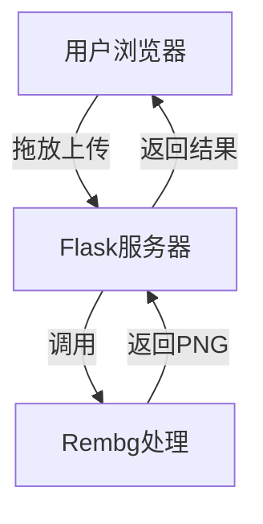

# 背景移除工具开发计划

## 1. 项目概述
开发一个基于Web的图片背景移除工具原型，实现通过浏览器拖放上传图片，自动移除背景并展示处理结果。

## 2. 功能需求
### 核心功能
- 前端拖放上传图片功能
- 自动背景移除处理
- 处理结果实时展示
- 支持常见图片格式(JPG/PNG等)

### 原型限制
- 单次处理一张图片
- 本地存储处理结果
- 无需用户认证系统
- 基础UI界面

## 3. 技术方案
### 技术栈
- **后端**：
  - 框架：Python Flask
  - 核心库：Rembg (基于U-Net的预训练模型)
  - 辅助库：Pillow (图像处理)

- **前端**：
  - 基础：HTML5 + CSS3 + JavaScript
  - 拖放库：Dropzone.js
  - 交互：Fetch API

### 系统架构

## 4. 开发任务
### 后端开发
1. 搭建Flask基础框架
2. 实现图片上传接口
3. 集成Rembg背景移除功能
4. 实现结果返回逻辑

### 前端开发
1. 创建基础HTML页面
2. 集成Dropzone拖放上传
3. 实现图片预览功能
4. 基本样式设计

### 测试部署
1. 本地功能测试
2. 跨浏览器兼容性测试
3. 基础性能测试

## 5. 时间规划
| 阶段 | 任务 | 耗时 |
|------|------|------|
| 第1天 | 环境搭建+后端基础 | 4h |
| 第2天 | 前端界面开发 | 4h |
| 第3天 | 功能联调测试 | 4h |
| 第4天 | 优化完善 | 4h |

## 6. 后续扩展
1. 批量图片处理功能
2. 背景替换/编辑功能
3. 用户系统集成
4. 云存储支持